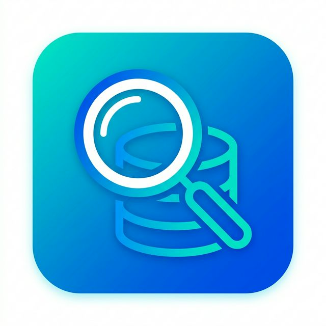

# DirSnap



## 📌 ¿Qué es y para qué sirve?

**DirSnap** es una herramienta de escritorio diseñada para ayudarte a **organizar, buscar y comparar colecciones gigantes de archivos**. 

¿Tienes discos duros o carpetas llenas de fotos, videos o documentos repetidos y no sabes exactamente qué hay en cada uno? Este programa te soluciona la vida permitiéndote:
- **Escanear un disco o carpeta completa** y guardar un "índice" (una base de datos) súper rápido con todo lo que contiene.
- **Comparar dos índices distintos** (por ejemplo, el índice de tu disco duro principal y el de tu disco de copias de seguridad) para ver qué archivos te faltan en un lado o cuáles están duplicados.
- **Previsualizar imágenes y videos** directamente desde la aplicación al seleccionar un archivo, para saber de un vistazo de qué archivo se trata.

---

## 🚀 ¿Cómo se usa? (Guía Rápida)

El uso del programa está pensado para ser muy visual y directo. Consta principalmente de dos pasos:

### 1. Crear un Índice (Base de datos) de tus carpetas
Si aún no has escaneado tus carpetas, primero debes crear tus índices:
1. Abre el programa.
2. Abre la herramienta para **crear una nueva base de datos** (Asistente de Indexación / Wizard).
3. Selecciona la carpeta, pendrive o disco duro que quieres inventariar.
4. El programa rastreará todos los archivos (extrayendo su tamaño y fecha) y creará un archivo `.db`. ¡Este archivo es tu inventario!

### 2. Comparar y Explorar
Una vez que tienes al menos dos archivos `.db` (inventarios), puedes cruzarlos:
1. En la ventana principal del programa verás dos paneles grandes (Izquierdo y Derecho).
2. Carga un archivo `.db` en el panel izquierdo que acabas de crear, y otro `.db` distinto en el panel derecho.
3. Automáticamente, el programa **comparará ambos lados**. Podrás usar filtros y colores para orientarte:
   - Las filas iluminadas en **verde** significan que el archivo existe en ambas partes (¡lo tienes copiado/respaldado!).
   - Las filas en **rojo** indican que el archivo solo está en ese lado (¡cuidado, podrías perderlo si no lo copias al otro lado!).
   > **Nota importante:** El programa verifica si un archivo está en ambos discos/carpetas analizando su contenido y tamaño, **no su ubicación**. No determina si los archivos están guardados en las mismas subcarpetas en ambos lados, sino que asegura que no los hayas perdido, independientemente de cómo estén organizados.
4. Haz clic en cualquier archivo de las listas para ver sus detalles exactos y una previsualización interactiva en el panel inferior (soporta imágenes y genera automáticamente miniaturas para videos).

---

## 🛠 Instalación y Ejecución

El programa está construido con **Avalonia UI**, lo que lo hace muy rápido y compatible multiplataforma.

Si tienes el código fuente y quieres ejecutarlo, asegúrate de tener instalado el **SDK de .NET**. Luego abre una terminal y ejecuta:

```bash
# Entrar a la carpeta del proyecto
cd Viewer

# Ejecutar la aplicación
dotnet run
```

---

## 🤓 Detalles Técnicos y Arquitectura (Para Desarrolladores)

Si eres desarrollador y te interesa saber cómo funciona "bajo el capó":

- **FileIndexerHelper (Escaneo veloz)**: Recorre directorios sin consumir memoria Heap usando estructuras optimizadas en C#. Guarda en la base de datos de manera atómica transaccional (bloques Batch en modo WAL) garantizando miles de inserciones por segundo.
- **Cross-Reference Engine (Comparación)**: El motor cruza las colecciones en memoria principal evaluando características únicas (`Hash + Tamaño` temporalmente o `Nombre + Tamaño`) mediante diccionarios en C# (LINQ), resultando en comparaciones instantáneas a gran escala.
- **Componentes UI y Multimedia**: Desarrollado con el patrón MVVM Behind en Avalonia UI. Descarga bajo demanda `FFmpeg` (usando `Xabe.FFmpeg`) para generar *thumbnails* de video en tiempo real sin bloquear la interfaz.
- **Ecosistema**: `Avalonia 11.3+`, `Microsoft.Data.Sqlite`, `Xabe.FFmpeg`.
